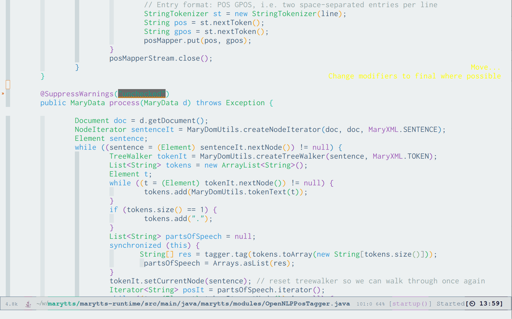

# FlatFluc theme

FlatFluc theme is a custom theme for Emacs corresponding of the merge of:
  - flucui light theme: https://github.com/MetroWind/flucui-theme
  - flatui theme: https://github.com/john2x/flatui-theme.el

## Screenshot



## Installation

I suggest to use quelpa

```elisp
  (use-package flatfluc-theme
    :ensure quelpa
    :quelpa (flatfluc-theme :fetcher github :repo "seblemaguer/flatfluc-theme")
    :tags '("VISUAL")
    :config
    (load-theme 'flatfluc))
```
